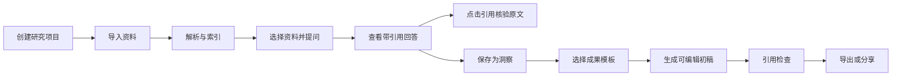

# 个人知识库 V2 产品需求文档

> 状态：方案基线
>
> 版本：V2.0 Draft
>
> 日期：2026-08-16
> 产品定位：个人自用、功能完整的项目制 AI 研究工作台

## 1. 产品结论

V2 不再把产品定义成“带 AI 的笔记列表”，而是一个能把零散资料转化为可核验结论和可交付成果的研究工作台。

一句话价值主张：

> 导入一组资料，围绕来源完成研究，10 分钟生成一份带引用、可继续编辑的研究简报。

V2 的基础闭环围绕三个核心对象展开：

- **Source（资料）**：PDF、DOCX、网页、Markdown、TXT 等原始证据。
- **Insight（洞察）**：用户或 AI 从资料中沉淀的带出处结论。
- **Output（成果）**：简报、对比分析、行动方案等可编辑、可导出的交付物。

## 2. 问题定义

当前版本解决了“本地保存几篇笔记并发起对话”，但还没有形成知识产品的核心价值链：

1. 笔记彼此孤立，没有项目边界和研究上下文。
2. 导入资料后缺少解析、索引、阅读状态和失败处理。
3. AI 回答与原文缺少稳定的段落级引用关系，用户无法快速核验。
4. 对话结果无法沉淀为洞察，也无法进一步转成可交付成果。
5. 首页、编辑器和聊天区的视觉层级接近，用户不清楚下一步该做什么。
6. 缺少可重复执行的完整工作流，无法稳定完成“收集—理解—核验—沉淀—输出”。

## 3. 使用方式与默认场景

### 3.1 产品服务对象

这是一个以个人需求和兴趣驱动的 vibe coding 项目，不以细分用户画像、商业转化或市场规模作为功能取舍依据。

产品默认由一个拥有完整权限的个人使用，重点覆盖：资料收集、主题研究、知识沉淀、长期检索、AI 辅助分析和内容输出。多人协作、组织权限、计费和增长系统不作为“完整度”的组成部分。

### 3.2 核心 JTBD

当我需要快速理解一个陌生主题并产出结论时，我希望把手头资料集中到一个项目里，让 AI 只根据这些资料回答，并且每个关键结论都能跳回原文核验，最后直接整理成可编辑、可导出的成果。

### 3.3 默认演示场景

**竞品研究简报**：用户导入 5–20 份网页、PDF 或文档，完成跨资料问答，保存关键洞察，生成一份带引用的竞品对比简报。

这个场景同时覆盖导入、检索、引用、阅读、洞察和成果生成，因此作为开发演示和回归测试场景；它不限制产品最终用途。

## 4. 产品原则

1. **证据先于回答**：没有可靠来源时必须明确说明，不编造引用。
2. **项目先于文件**：用户围绕研究目标组织资料，而不是维护无限增长的笔记列表。
3. **阅读与 AI 同屏**：引用核验不应打断当前任务。
4. **成果先于聊天记录**：有价值的回答应能一键沉淀并继续编辑。
5. **渐进式复杂度**：首次使用只暴露“导入—提问—生成”主路径，高级设置按需出现。
6. **中文知识工作优先**：中文分段、引用、排版和导出质量必须达到可交付水平。
7. **完整但不堆砌**：资料、检索、知识组织、AI、成果、同步和备份都形成可用闭环；功能必须有入口、状态、错误处理和删除路径。
8. **个人掌控优先**：支持本地运行、数据导出、模型切换和自带密钥，避免产品被单一服务商锁死。

### 4.1 完整度定义

“完整”不是把所有热门 AI 功能放进导航，而是以下七条链路都没有断点：

1. **采集完整**：本地文件、网页、粘贴文本、批量导入和浏览器剪藏都有稳定入口。
2. **解析完整**：支持文本、表格、图片 OCR、音视频转写，并显示进度、失败原因与重试。
3. **检索完整**：项目内搜索、跨项目搜索、关键词检索、向量检索和过滤条件协同工作。
4. **研究完整**：问答有引用、引用可定位、资料冲突可识别、答案可继续追问。
5. **沉淀完整**：回答可变成洞察，洞察可组织、关联、编辑并回溯来源。
6. **输出完整**：成果可生成、编辑、检查引用，并导出 Markdown、PDF 和 DOCX。
7. **数据完整**：备份、恢复、迁移、删除、模型配置和运行状态都由用户掌控。

## 5. 信息架构

```text
首页
├─ 最近项目
├─ 新建研究项目
└─ 全局搜索

研究项目
├─ Sources 资料
│  ├─ 导入与解析状态
│  ├─ 来源筛选
│  └─ 原文阅读与引用定位
├─ Insights 洞察
│  ├─ 收藏的回答片段
│  ├─ 手工洞察
│  └─ 标签与来源关系
└─ Studio 成果
   ├─ 研究简报
   ├─ 对比分析
   ├─ 行动方案
   └─ 编辑、引用检查与导出
```

桌面端研究工作区采用三栏结构：左栏为资料，中栏为阅读器或成果编辑器，右栏为研究助手。移动端改为“资料 / 阅读 / 助手”三个页签，不横向压缩三栏。

## 6. 核心用户流程



### 6.1 首次体验目标

- 从进入首页到创建项目：不超过 30 秒。
- 从上传资料到首次可提问：普通文本资料不超过 60 秒。
- 从首次提问到定位引用：不超过 2 次点击。
- 从已有洞察生成简报初稿：不超过 3 次点击。

## 7. 核心功能（第一实现阶段）

### 7.1 项目与首页

| 编号 | 需求 | 验收标准 |
|---|---|---|
| CORE-01 | 创建、重命名、归档研究项目 | 项目名称必填；归档后默认不出现在最近项目中；可恢复 |
| CORE-02 | 最近项目首页 | 显示项目名称、资料数、最近更新时间和最近成果；支持搜索当前项目列表 |
| CORE-03 | 空状态引导 | 首次使用只看到一个主行动“创建第一个研究项目”，并提供竞品研究示例 |

### 7.2 资料导入、解析与索引

| 编号 | 需求 | 验收标准 |
|---|---|---|
| CORE-04 | 导入 PDF、DOCX、TXT、MD 和网页 URL | 单次最多 20 个文件；明确展示格式、大小和失败原因 |
| CORE-05 | 异步解析状态 | 每份资料有上传中、解析中、可用、失败四种状态；失败可重试或删除 |
| CORE-06 | 文本切分与定位 | 每个文本块保存来源、页码或段落号、字符区间和标题层级 |
| CORE-07 | 向量与关键词混合检索 | 中文查询可返回相关片段；结果按项目和选中资料严格过滤 |
| CORE-08 | 资料管理 | 支持重命名、启用或停用、删除、查看元信息和解析文本 |

### 7.3 基于来源的问答

| 编号 | 需求 | 验收标准 |
|---|---|---|
| CORE-09 | 选择资料范围提问 | 默认使用项目内全部可用资料；可取消单份资料；回答明确显示使用范围 |
| CORE-10 | 流式回答 | 用户提交后 2 秒内出现响应状态；支持停止生成和重新生成 |
| CORE-11 | 段落级引用 | 每个事实性段落至少有一个引用；引用包含资料名与页码或段落号 |
| CORE-12 | 引用跳转与高亮 | 点击引用后，中栏打开对应资料并高亮原文；用户可返回原阅读位置 |
| CORE-13 | 无证据处理 | 检索证据不足时回答“当前资料中没有足够依据”，并建议补充资料或换问法 |
| CORE-14 | 会话管理 | 项目内保留多个会话；新会话不丢失资料选择和已保存洞察 |

### 7.4 洞察沉淀

| 编号 | 需求 | 验收标准 |
|---|---|---|
| CORE-15 | 保存回答为洞察 | 用户可选中回答片段保存；自动带上原引用、创建时间和来源会话 |
| CORE-16 | 手工创建洞察 | 支持标题、正文、标签和来源引用；无引用洞察有明显提示 |
| CORE-17 | 洞察列表 | 可按标签和来源筛选；支持编辑、删除和添加到成果 |

### 7.5 Studio 成果

| 编号 | 需求 | 验收标准 |
|---|---|---|
| CORE-18 | 三个基础模板 | 提供研究简报、对比分析、行动方案；模板说明输入和产出结构 |
| CORE-19 | 从资料和洞察生成初稿 | 生成前可确认资料、洞察、语言和篇幅；生成后进入可编辑状态 |
| CORE-20 | 块编辑器 | 支持标题、正文、列表、引用块；AI 只能重写用户选中的块 |
| CORE-21 | 引用检查 | 标出缺少引用、引用失效和资料已删除的内容；导出前可一键检查 |
| CORE-22 | 导出 | 支持 Markdown、PDF 和 DOCX；导出内容保留脚注与来源列表 |

## 8. 关键页面规格

### 8.1 首页

目标：让回访用户快速继续项目，让新用户立即开始一次研究。

- 顶部：产品标识、全局搜索入口、用户菜单。
- 主区域：欢迎语、一个主行动“新建研究项目”、最近项目列表。
- 项目卡只展示完成任务所需信息：名称、资料数、洞察数、最近成果、更新时间。
- 不展示虚构的知识统计、AI 评分或装饰性图表。

### 8.2 研究工作区

目标：在不离开当前上下文的情况下完成资料选择、原文阅读、提问和引用核验。

- 项目级导航：Sources、Insights、Studio。
- 左栏 Sources：导入按钮、资料状态、勾选范围、资料搜索。
- 中栏 Reader：原文标题、页码导航、正文、当前引用高亮。
- 右栏 Copilot：当前资料范围、对话、引用、保存洞察和输入框。
- 拖动可调整左右栏宽度，最窄时优先保证阅读区可读性。

### 8.3 引用交互

- 引用在回答中使用连续编号，例如 `[1]`、`[2]`。
- 悬停或聚焦引用时显示不超过三行的原文预览。
- 点击后打开来源并高亮原句；右侧回答保持原滚动位置。
- 同一段有多个来源时显示多个编号，不合并成模糊的“来源”。
- 引用定位失败时保留来源信息，并提示重新解析，不静默跳到文档开头。

### 8.4 Studio

目标：把研究过程转成用户真正可以交付的内容。

- 左侧为模板与素材选择，中间为成果编辑器，右侧为结构建议与引用检查。
- 初稿生成后默认进入编辑模式，不把 AI 输出当成不可修改的最终结果。
- 每个事实块展示引用状态；无引用内容仍允许保存，但不能显示为“已核验”。
- 导出前展示缺失引用、失效引用和未完成占位符。

### 8.5 移动端

- 底部或顶部提供“资料 / 阅读 / 助手”页签，一次只展示一个主面板。
- 点击回答引用自动切换到阅读页签并定位原文。
- 输入框吸附在助手面板底部，但不使用全局固定定位造成遮挡。
- Studio 移动端优先支持查看、轻编辑和导出；复杂结构编辑留给桌面端。

## 9. AI 与检索规则

### 9.1 检索链路

1. 对查询进行意图识别和必要的中文改写。
2. 在当前项目、当前选择的资料范围内执行关键词与向量混合检索。
3. 对候选片段重排，保留来源多样性并去除重复段落。
4. 将片段连同稳定引用 ID 发送给模型。
5. 生成后校验引用 ID 是否存在、是否支持对应陈述。
6. 保存回答、引用映射和使用的检索版本，保证后续可追踪。

### 9.2 回答约束

- 只依据传入证据回答，不使用模型记忆补齐事实。
- 明确区分“资料事实”“综合判断”和“下一步建议”。
- 无法从资料确认的内容必须使用不确定表达。
- 引用必须指向实际被模型使用的片段，禁止只给文档级引用。
- 任何模型供应商都通过统一 Provider 接口接入，前端不保存密钥。

### 9.3 质量评估

建立 50 个中文研究问题的固定评测集，至少覆盖：

- 单资料事实定位。
- 跨资料比较与冲突识别。
- 表格或列表信息提取。
- 资料中不存在答案时的拒答。
- PDF 页码、DOCX 段落和网页标题引用定位。

核心闭环完成门槛：引用可定位率 ≥ 95%，无依据回答率 ≤ 5%，核心问题人工可接受率 ≥ 80%。

## 10. 数据模型草案

| 实体 | 关键字段 |
|---|---|
| User | id, email, locale, created_at |
| Project | id, user_id, title, description, status, created_at, updated_at |
| Source | id, project_id, type, title, origin_url, file_path, parse_status, metadata |
| SourceChunk | id, source_id, text, page, paragraph, heading_path, start_offset, embedding |
| Conversation | id, project_id, title, created_at, updated_at |
| Message | id, conversation_id, role, content, model, retrieval_version, created_at |
| Citation | id, message_id, source_chunk_id, quote, claim_index |
| Insight | id, project_id, title, content, tags, source_message_id, created_at |
| InsightCitation | insight_id, source_chunk_id |
| Output | id, project_id, template, title, content_json, status, created_at, updated_at |
| OutputCitation | output_id, block_id, source_chunk_id |

删除 Source 时采用软删除并标记关联引用失效，避免历史成果静默改变。

## 11. 技术方案基线

### 11.1 推荐栈

- Web：Next.js + React + TypeScript。
- UI：Tailwind CSS + shadcn/ui，建立小型产品设计令牌。
- 数据库：PostgreSQL + pgvector。
- 认证与文件：Supabase Auth + Storage，或等价自托管方案。
- 解析任务：独立 Worker + 队列；文档解析、切分、嵌入和 OCR 与请求线程分离。
- AI：统一 Provider 层，先接入一个默认模型和一个自定义 OpenAI-compatible 端点，再补齐多供应商切换与失败回退。
- 可观测性：结构化日志、错误追踪、AI 请求耗时与成本记录。

### 11.2 架构边界

- 浏览器只持有短期会话，不持有模型密钥。
- 原始文件、解析文本、向量和用户成果按用户与项目隔离。
- 每次 AI 生成保存模型、参数、检索片段和引用映射。
- 长任务均可重试并幂等，刷新页面后仍能看到真实状态。
- 数据导出和账户删除必须覆盖原始文件、索引、会话和成果。

## 12. 设计语言

- 气质：安静、可信、适合长时间阅读，不模仿聊天软件的高饱和气泡界面。
- 视觉焦点：正文和证据；品牌色只用于主行动、选中状态和引用高亮。
- 密度：桌面端偏专业工具密度，避免大面积欢迎卡与无意义留白。
- 文字：正文优先 16px 左右的阅读尺度，界面标签清晰克制。
- 状态：上传、解析、生成和失败均使用文字加图标，不依赖颜色单独传达。
- 动效：只用于面板切换、定位引用和生成进度，尊重减少动态效果设置。

## 13. 完整度与质量指标

### 13.1 核心完成指标

**每周完成的“有来源成果”数量（Weekly Source-backed Outputs）**。

“有来源成果”定义：至少包含 3 个有效引用，且被用户编辑、导出或再次打开。

该指标用于判断整条工作流是否真的可用，不承担商业增长或用户留存目标。

### 13.2 系统质量指标

| 维度 | 指标 |
|---|---|
| 导入 | 各格式解析成功率、平均解析时间、失败重试成功率 |
| 检索 | Top-K 相关性、跨项目搜索耗时、过滤条件正确率 |
| 引用 | 引用覆盖率、引用定位成功率、失效引用检出率 |
| AI | 首字延迟、完整生成耗时、模型错误率、单次成本 |
| 成果 | 引用检查通过率、导出成功率、格式还原度 |
| 数据 | 备份恢复成功率、迁移一致性、异常退出后的数据恢复率 |
| 体验 | 核心任务完成时间、键盘可达性、移动端横向溢出数量 |

### 13.3 诊断事件

`project_created`、`source_imported`、`source_parse_completed`、`question_asked`、`citation_opened`、`insight_saved`、`output_generated`、`output_edited`、`citation_check_run`、`output_exported`。

事件默认只保存在本地诊断日志中；如未来接入远程分析，必须提供关闭开关并移除资料正文、问题内容和模型输出。

## 14. 版本计划

版本按技术依赖推进，不设置“做完 MVP 就停止”的边界。每个阶段完成后都保持主分支可运行、可回归、可备份。

### 阶段 A：体验骨架

- 确认设计令牌、首页、项目工作区和移动端导航。
- 搭建前端路由、项目模型和模拟数据。
- 完成资料、阅读器、助手三栏的可用交互骨架。

### 阶段 B：证据闭环

- 接入认证、存储、解析队列和向量检索。
- 完成资料状态、范围选择、问答、段落引用和原文定位。
- 建立固定评测集与引用质量门槛。

### 阶段 C：成果闭环

- 完成洞察沉淀、三个 Studio 模板、块编辑和引用检查。
- 完成 Markdown、PDF、DOCX 导出和数据备份。

### 阶段 D：采集与检索增强

- 完成全局跨项目搜索、网页剪藏、批量 URL 导入和重复资料检测。
- 补齐 OCR、表格解析、音视频转写和多语言文本处理。
- 增加时间线、术语表、FAQ、实体和双向关联视图。

### 阶段 E：个人工作台增强

- 支持自定义成果模板、提示词和快捷指令。
- 支持多模型 Provider、自带密钥、成本统计和模型回退。
- 支持定时索引、文件夹监听、PWA 离线壳和跨设备同步。
- 支持只读成果分享，但不建设组织权限和复杂协作系统。

### 阶段 F：智能化与长期维护

- 增加可审阅的 Agent 工作流，例如定期资料摘要、冲突检查和研究任务拆解。
- 增加知识图谱、来源版本变化检测和过期引用提醒。
- 建立数据库迁移、自动备份、恢复演练、端到端测试和性能基线。
- 清理演示数据、失效配置和历史兼容代码，形成可长期维护的完整版本。

## 15. 完整功能范围

### 15.1 纳入完整版本

- 全局跨项目搜索。
- 时间线、术语表和常见问题自动生成。
- 自定义成果模板。
- 多模型选择、自带密钥、成本控制和失败回退。
- 浏览器剪藏插件。
- 分享只读成果链接。
- 音频、视频转写与 OCR 增强。
- 表格提取、网页正文清洗和重复资料检测。
- 自动执行任务的 Agent 与快捷指令。
- 音频概览、视频概览和知识图谱。
- 来源更新检测、失效引用提醒和项目健康检查。
- 完整备份恢复、跨设备同步、PWA 与离线只读。

上述功能全部属于目标范围，但仍按照“基础设施—证据—成果—增强能力”的依赖关系依次实现。

### 15.2 明确不做

- 订阅广场、公共内容社区和创作者增长系统。
- 计费、套餐、邀请裂变和商业化后台。
- 企业组织架构、复杂角色权限和多人实时协同编辑。
- 为覆盖所有人群而增加的行业模板市场。

这些能力服务于商业化或团队协作，不影响个人知识库本身的完整度。

## 16. 发布验收清单

- [ ] 新用户能在无说明文档的情况下完成创建项目、导入、提问和打开引用。
- [ ] 所有支持格式均有成功、失败、重试和删除路径。
- [ ] 回答中的引用可通过键盘访问，并能准确定位原文。
- [ ] 无证据问题不会生成伪引用或确定性结论。
- [ ] 洞察保留原始出处，加入成果后引用关系不丢失。
- [ ] 三个 Studio 模板均可生成、编辑、检查引用并导出。
- [ ] 全局搜索能够检索项目、资料、洞察、对话和成果，并可回到原始位置。
- [ ] PDF、DOCX、网页、图片、音频和视频均具备成功、失败、重试与删除路径。
- [ ] Markdown、PDF、DOCX 三种成果导出通过中文排版与引用脚注检查。
- [ ] 多模型切换、自带密钥、超时重试和供应商失败回退可用。
- [ ] 完整备份可以在全新环境恢复项目、资料关系、洞察、对话和成果。
- [ ] 320px、390px、736px 和常见桌面宽度无横向溢出。
- [ ] 亮色和暗色主题均满足文字与交互状态对比度要求。
- [ ] 模型密钥、原始文件与项目数据不暴露给其他用户或前端日志。
- [ ] 质量事件可在本地诊断页查询，错误和长任务可追踪。
- [ ] 核心流程具备自动化回归测试，数据库升级具备迁移与回滚说明。

## 17. 已锁定决策与待定技术选型

### 已锁定

- V2 以项目为一级对象。
- 产品以个人自用和功能完整度为目标，不围绕用户画像或商业指标裁剪能力。
- 竞品研究简报只是默认演示和回归场景，不是产品边界。
- 引用必须达到段落级并可跳回原文。
- AI 结果先转为洞察，再进入成果，而不是堆积在聊天历史里。
- 桌面端采用三栏研究工作区，移动端采用单面板页签。
- 完整版本支持 Markdown、PDF、DOCX 导出，以及多模型与自带密钥。
- 全部增强功能分阶段完成，不保留模糊的“以后再做”列表。

### 待定技术选型

- 本地优先数据库采用 SQLite，还是直接使用 PostgreSQL + pgvector。
- 跨设备同步采用 Supabase，还是独立部署同步服务。
- 文档解析采用统一 Python Worker，还是 Node.js 与 Python 混合任务队列。
- 浏览器剪藏采用扩展程序，还是先提供 Bookmarklet 与分享入口。
- Agent 采用固定可审阅工作流，还是引入通用工具调用框架。

## 18. 本轮原型检查任务

交互原型优先检查四件事：

1. 首页是否能让自己立即理解“创建研究项目”的价值。
2. 三栏工作区是否能支持资料选择、问答与阅读引用的连续动作。
3. “保存为洞察”是否比收藏整段聊天更自然。
4. Studio 是否能自然地把研究过程变成可交付成果。

使用固定回归任务自测：“导入竞品资料，找出三个差异点并生成一页简报”。每次大改后记录任务是否完成、引用是否准确、是否出现迷失点、数据是否可恢复，以及最终成果能否无修复导出。
