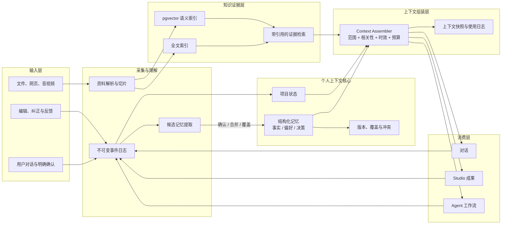

# Personal Context Engine V2

> 下图是目标架构，不代表所有模块已实现。当前已实现文件解析、SQLite 关键词检索、带版本引用的资料问答、长期记忆审核与上下文组装。网页/音视频采集、pgvector 语义检索、项目状态自动更新、Studio 和自主 Agent 工作流属于后续方向。应用目前是本机单用户产品。

V2 的目标不是把所有信息都塞进向量库，而是把“事实、偏好、决策、项目状态”和“外部资料证据”分开治理，在每次对话或 Agent 执行前按需组装。

## 不可破坏的约束

1. **事件不可变**：用户确认、纠正和 Agent 动作先写事件日志，便于追溯。
2. **确认后生效**：候选记忆不会直接污染长期上下文；只有经过用户确认且状态为 `active` 的记忆可被组装。
3. **更新不是覆盖历史**：记忆修改必须产生版本；冲突、替代和过期关系显式保存。
4. **记忆不冒充证据**：个人上下文负责连续性，资料索引负责原文引用，二者在组装层才汇合。
5. **每次组装可解释**：保存候选得分、选中原因、token 预算和最终快照，便于调试“为什么记住/忘了”。

## 已实现的记忆治理链路

当前实现既支持用户直接确认一句话，也支持从一段对话或项目说明中提取候选：

`POST /api/memory-candidates` → 写入原始事件 → 提取候选 → 用户新增、合并、替代或拒绝 → 写入结构化记忆及版本关系 → `POST /api/context/assemble` → 按范围、相关性、重要度、时效和预算选取 → 保存上下文快照。

“合并”会更新同一条记忆并增加版本号；“替代”会让旧记忆进入 `superseded` 状态，同时创建指向旧记忆的新记录；“拒绝”不会写入长期记忆。

资料解析及带版本引用的问答已独立接入；文档不会自动进入个人记忆链路。项目状态自动更新和 Agent 工作流仍是后续方向。
